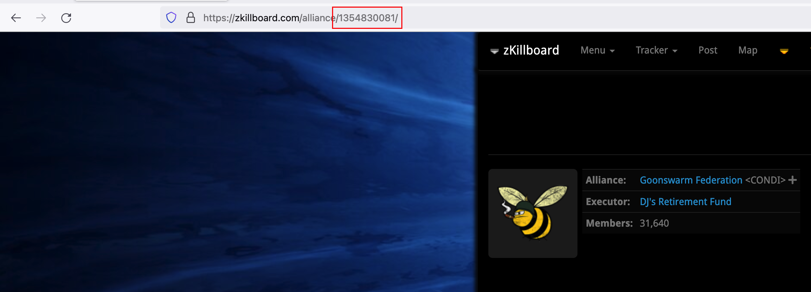

# hazardous-killbot

[Invite the Bot to your Server!](https://discord.com/api/oauth2/authorize?client_id=981835348030160948&permissions=274877925376&scope=bot%20applications.commands)

User: Hazardous-Killbot#1916

Posts EvE-Online Killmails von zkillboard.com to a discord channel using the zkillboard webhook endpoint and discord.js

[Join Our Discord for support and raffles](https://discord.gg/ACCRMvPGSf)

The bot was developed by [SvenBrnn](https://zkillboard.com/character/694883910/), ISK donations are always welcome if you like my work ;)

## Commands

| key                                              | description                                                                                      |
|--------------------------------------------------|--------------------------------------------------------------------------------------------------|
| /zkill-subscribe corporation [id] ([min-vaue])   | Make bot post kills of corporation with id [id] ([min-value] is optional minimal amout of isk)   |
| /zkill-subscribe alliance [id] ([min-vaue])      | Make bot post kills of alliance with id [id] ([min-value] is optional minimal amout of isk)      |
| /zkill-subscribe character [id] ([min-vaue])     | Make bot post kills of character with id [id] ([min-value] is optional minimal amout of isk)     |
| /zkill-subscribe region [id] ([min-vaue])        | Make bot post kills of region with id [id] ([min-value] is optional minimal amout of isk)        |
| /zkill-subscribe constellation [id] ([min-vaue]) | Make bot post kills of constellation with id [id] ([min-value] is optional minimal amout of isk) |
| /zkill-subscribe system [id] ([min-vaue])        | Make bot post kills of system with id [id] ([min-value] is optional minimal amout of isk)        |
| /zkill-subscribe group [id] ([min-vaue])         | Make bot post kills of ship group with id [id] ([min-value] is optional minimal amout of isk)    |
| /zkill-subscribe ship [id] ([min-vaue])          | Make bot post kills of ship with id [id] ([min-value] is optional minimal amout of isk)          |
| /zkill-subscribe public ([min-vaue])             | Make bot post kills the public feed ([min-value] is optional minimal amout of isk)               |
| /zkill-subscribe link [url] ([min-vaue])         | Make bot post kills of the zkillboard link [url]                                                 |
| /zkill-unsubscribe corporation [id]              | Make the bot not post any kills for corporation [id] anymore                                     |
| /zkill-unsubscribe alliance [id]                 | Make the bot not post any kills for alliance [id] anymore                                        |
| /zkill-unsubscribe corporation [id]              | Make the bot not post any kills for character [id] anymore                                       |
| /zkill-unsubscribe region [id]                   | Make the bot not post any kills for region [id] anymore                                          |
| /zkill-unsubscribe constellation [id]            | Make the bot not post any kills for constellation [id] anymore                                   |
| /zkill-unsubscribe system [id]                   | Make the bot not post any kills for system [id] anymore                                          |
| /zkill-unsubscribe group [id]                    | Make the bot not post any kills for ship group [id] anymore                                      |
| /zkill-unsubscribe ship [id]                     | Make the bot not post any kills for ship [id] anymore                                            |
| /zkill-unsubscribe public                        | Make the bot not post any kills of the public feed anymore                                       |
| /zkill-unsubscribe all                           | Make the bot not post any on this channel anymore                                                |
| /zkill-unsubscribe link [url]                    | Make the bot not post any kills for zkillboard link [url]                                        |
| /zkill-list-subscriptions                        | List all subscriptions of the channel                                                            |

Where to find the id?

Open your corp/char/alliance page on zkillboard and copy the number at the end of the link.

## Develop

### Requirements:

- docker
- docker-compose

### Startup (dev):

- run `copy the env.sample to .env and fill out params`
- run `docker-compose up`

### Startup (prod):
 
- run `copy the env.sample to .env and fill out params`
- run either `docker-compose -f ./docker-compose.prod.yaml up`
- if redis is enabled you can open the dashboard at `http://localhost:4000`

### Build (prod):
 
- run `cd src && docker-compose -f ./docker-compose.prod.yaml build`

### Config:

#### Environment

| key                | description                        |
|--------------------|------------------------------------|
| DISCORD_BOT_TOKEN  | Your discord bot token             |
| DISCORD_CLIENT_ID  | Your discord application client id |
| QUEUE_IDENTIFIER   | Redis queue identifier             |

## Licence 
Copyright 2025 SvenBrnn

Permission is hereby granted, free of charge, to any person obtaining a copy of this software and associated documentation files (the "Software"), to deal in the Software without restriction, including without limitation the rights to use, copy, modify, merge, publish, distribute, sublicense, and/or sell copies of the Software, and to permit persons to whom the Software is furnished to do so, subject to the following conditions:

The above copyright notice and this permission notice shall be included in all copies or substantial portions of the Software.

THE SOFTWARE IS PROVIDED "AS IS", WITHOUT WARRANTY OF ANY KIND, EXPRESS OR IMPLIED, INCLUDING BUT NOT LIMITED TO THE WARRANTIES OF MERCHANTABILITY, FITNESS FOR A PARTICULAR PURPOSE AND NONINFRINGEMENT. IN NO EVENT SHALL THE AUTHORS OR COPYRIGHT HOLDERS BE LIABLE FOR ANY CLAIM, DAMAGES OR OTHER LIABILITY, WHETHER IN AN ACTION OF CONTRACT, TORT OR OTHERWISE, ARISING FROM, OUT OF OR IN CONNECTION WITH THE SOFTWARE OR THE USE OR OTHER DEALINGS IN THE SOFTWARE.
